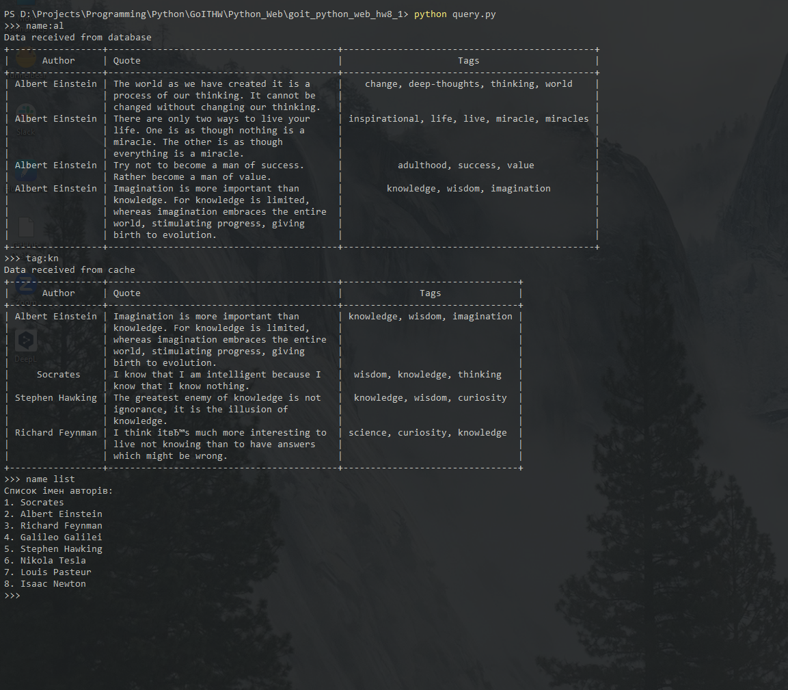

# Домашнє завдання #8

Робота з базою [`MongoDB`](https://www.mongodb.com/)[^1] за допомогою [`ODM MongoEngine`](https://docs.mongoengine.org/)[^2] та реалізація кешування за допомогою [`Redis`](https://redis.io/)[^3].

[^1]: Документо-орієнтована система керування базами даних (СКБД) з відкритим вихідним кодом, яка не потребує опису схеми таблиць. `MongoDB` займає нішу між швидкими і масштабованими системами, що оперують даними у форматі ключ/значення, і реляційними СКБД, функціональними і зручними у формуванні запитів.
[^2]: `MongoEngine` - це об'єктно-документний маппер (Object-Document Mapper), написаний на Python для роботи з MongoDB.
[^3]: `Redis` - це сховище даних з відкритим вихідним кодом, яке використовується мільйонами розробників як база даних, кеш, потоковий движок і брокер повідомлень. В даному завданні використовується для кешування даних.

## Вигляд вікна проекту



## Установка і запуск проекту

Для управління залежностями проекту використовується `pipenv`. Необхідно встановити `pipenv` перед виконанням наступних кроків:

- Склонируйте репозиторий:

  ```shell
  git clone https://github.com/sergiokapone/goit_python_web_hw8_1_.git
  ```

- Для встановлення залежностей використайте команду `pipenv install` або `pipenv sync`.

## Сртуктура проекту

```text
.
├── database/
│   ├── connect.py          # Код для керування підключенням до бази даних
│   └──  models.py          # Визначення моделей даних
├── Pipfile
├── authors.json            # Джерело авторів для внесення в базу
├── quotes.json             # Джерело цитат для внесення в базу
├── config.ini              # Налаштування для підключення до бази даних
├── README.MD               # Цей файл
├── upload.py               # Код для заповнення бази даних початковими даними
└── query.py                # Код виконання запитів до бази даних
```

## Заповнення бази даних

Для заповнення бази даних можна скористатись командою `python upload.py`. Файл `upload.py`
містить сценарій для завантаження данних з файлів `authors.json` та `quotes.json` до бази данних.

## Запити до бази данних

`query.py` є інтерфейсом командного рядка (CLI). який дає змогу взаємодіяти з базою даних студентів із командного рядка.

## Команди для виконання запитів

- `name list` - виводить список усіх імен авторів.
- `tags` - виводить список усіх доступних тегів.
- `name: <ім'я_автора>` - виводить цитати автора за заданим ім'ям.
- `tag: <тег>` - виводить цитати за заданим тегом.
- `tags: <тег_1>, <тег_2>, ...` - виводить цитати, які містять усі задані теги.
- `exit` - завершує виконання програми.

Програма має особливість, яка дозволяє скорочено задавати значення для пошуку за ім'ям автора та тегом.

`name:<початкові літери імені>`
`tag:<початкові літери тегів>`

Приклад:

- `name:st` - пошук цитат авторів, прізвища яких починаються на `St`.
- `tag:li` - пошук цитат авторыв, які мають теги, що містять на початку літери `li`.

## Кешування даних за допомогою `Redis`

Щоб реалізувати [`LRU` кеш](<https://en.wikipedia.org/wiki/Cache_replacement_policies#Least_recently_used_(LRU)>)[^4] за допомогою бази даних `Redis`, треба розгорнути докер контейнер:

```shell
docker run --name redis-cache -d -p 6379:6379 redis
```

[^4]: `LRU`, або `LRU cache` (Least Recently Used) - алгоритм для зберігання обмеженого обсягу даних: зі сховища витісняється інформація, яка не використовувалася найдовше. Його застосовують під час організації кешу.

Для визначення, чи встановлене з'єднання з `Redis` було перевизначено стандартний декоратор `cache` на такий, що перевіряє стан цього з'єднання:

```python
def cache_decorator(func):
    @wraps(func)
    def wrapper(*args, **kwargs):

        try:
            decoration = cache(func)(*args, **kwargs)
            return decoration
        except ConnectionError:
            print("Warning! Redis connection error.")

        return func(*args, **kwargs)

    return wrapper
```

У випадку, якщо сервер Redis не доступний, видається попередження

```text
Warning! Redis connection error.
```
